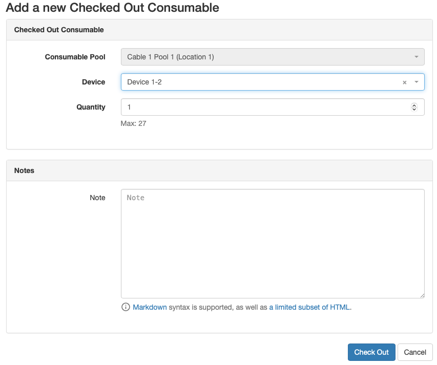

Checked Out Consumables track the number of a particular Consumable that have been placed into use from a Consumable Pool.
These may be the 15' ethernet cables used to connect top-of-rack switches together, or transceiver used for plugging the cables into devices.
When Consumables are pulled from storage for active use, they should be checked out so that the available inventory quantity remains accurate.

To check out a consumable, set the Device where it is used and the quantity to be used.

!!! info
    If you are checking out a consumable via the **Check Out** button on an item in a Device's Consumable Pool list, the assigned Device will be set automatically.

<picture>
  <source media="(prefers-color-scheme: dark)" srcset="../assets/screens/checkedoutconsumable_dark.png">
  
</picture>
