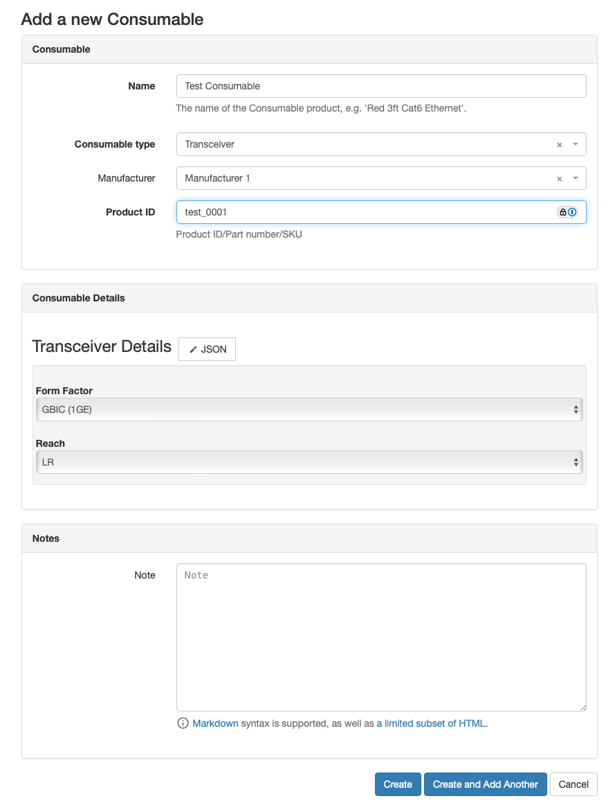

A Consumable represents a physical consumable that has a manufacturer, product ID, type, etc., and is used to create a Consumable Pool.
This allows for standardization between projects so that you don't wind up with 42 different variations of the same product.
Typical Consumables would be things like a 15' Red Cat6A patch cable, 200 yard roll of Velcro strapping, or an LX SFP+ module.

<picture>
  <source media="(prefers-color-scheme: dark)" srcset="../assets/screens/consumable_dark.png">
  
</picture>

!!! info
    When adding a new Consumable, the details form will dynamically updated for the schema of the chosen Consumable Type.
    Once a Consumable is created, its Consumable Type cannot be changed, and when editing an existing consumable the form will prevent you from changing the selection.
