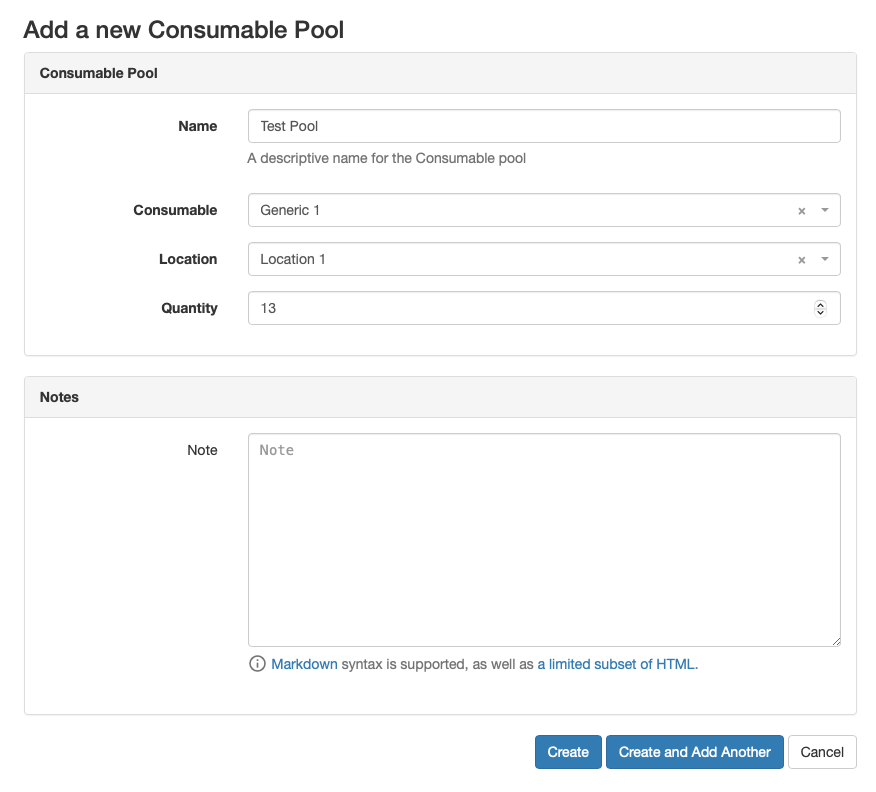

Consumables Pools are the available physical assets represented by a Consumable.
When adding a new Consumable Pool, a Consumable is selected along with the storage location, and quantity.

<picture>
  <source media="(prefers-color-scheme: dark)" srcset="../assets/screens/consumablepool_dark.png">
  
</picture>

!!! info
    Once created, the base consumable of a pool cannot be changed, but the quantity and storage location can be updated.
    Note that changing the storage location will cause any checked out consumables from the pool to be checked back in.
