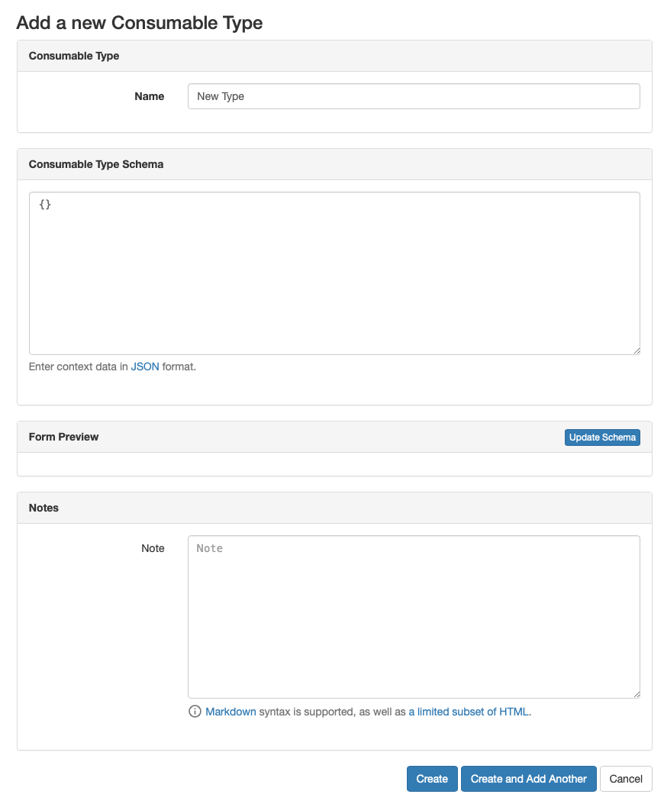
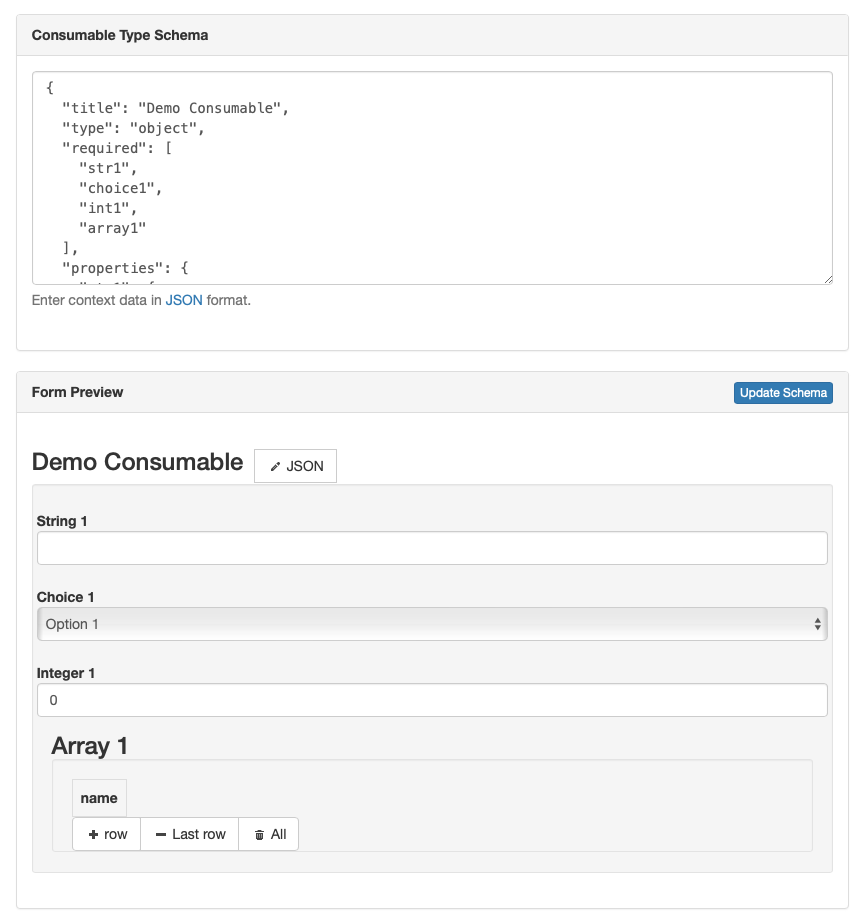

A Consumable Type is a generic category of consumable, not a specific product, and include things like cables, transceivers, screws, labels, etc.
**Genric**, **Cable**, and **Transceiver** Consumable Types are included with the Consumables plugin by default, and additional types can be added as needed.
Consumable Types are the basis for all other consumables, each Consumable must be assigned a Consumable Type.
Basic rule of thumb is that a category of product should be a Consumable Type, but if the product you're adding has a Manufacturer or Product ID it should be a Consumable.

## Defining a Consumable Type

<picture>
  <source media="(prefers-color-scheme: dark)" srcset="../assets/screens/consumabletype_dark.png">
  
</picture>

Consumable Types utilize [JSON Schemas](https://json-schema.org/) to allow for unique, detailed information to be stored for individual Consumables.
The JSON schema is used to display an editor on the forms that makes adding and editing data in a consistent way more convenient.
On the backend, there is validation on both the schema and the details to ensure that the input data is valid for that Consumable Type.

The JSON form utilizes [JSON Editor](https://github.com/json-editor/json-editor) to display the JSON schema in an easy to update form.
JSON Editor has support for JSON Schema versions 3 and 4.

!!! important
    In order to simplify displaying data, `$ref` definitions are not currently supported.

The JSON Editor supports an extra attribute, `propertyOrder`, that will sort the properties in that order.
The Consumables app also utilizes this field to order fields when displaying to the end user.
The closer to 0 the number is, the higher in the form it will be displayed.

The Consumables app has an added feature that if you need to use units, e.g. m, ft, etc., you can use `name` for the integer and `name_unit` for the units.
Those fields will then be combined when displayed to the user, e.g. **1 ft**.

!!! tip
    As you're editing the schema for a Consumable Type, you can click the **Update Schema** button in the **Form Preview** panel of the form to see how the schema translates to a web form at any point.
    <picture>
      <source media="(prefers-color-scheme: dark)" srcset="../assets/screens/consumabletype_schema_dark.png">
      
    </picture>


### Sample JSON Schema

```json
{
    "title": "Demo Consumable",
    "type": "object",
    "required": [
        "str1",
        "choice1",
        "int1",
        "array1"
    ],
    "properties": {
        "str1": {
            "title": "String 1",
            "type": "string"
        },
        "choice1": {
            "title": "Choice 1",
            "type": "string",
            "enum": [
                "option-1",
                "option-2",
                "option-3"
            ],
            "options": {
                "enum_titles": [
                    "Option 1",
                    "Option 2",
                    "Option 3"
                ]
            }
        },
        "int1": {
            "title": "Integer 1",
            "type": "integer",
            "minimum": 0,
            "maximum": 42
        },
        "array1": {
            "title": "Array 1",
            "type": "array",
            "format": "table",
            "items": {
                "type": "object",
                "properties": {
                    "name": {
                        "type": "string"
                    }
                }
            }
        }
    }
}
```

### Example Type Creation

When adding a new Consumable Type, it may be advantageous to use Choice Fields already built in to Nautobot (Colors, Cable Types, Port Types, etc.), this can be done via the ORM or updating `signals.py`.

!!! info
    `signals.py` has some helpers to make it easier to convert a built-in choice to a JSON object.

Below is an example of a Rack Consumable Type that could be added to `signals.py`, triggering its creation at the post-migration step when installing/upgrading the Consumables app.

```python
# signals.py
from nautobot.dcim.choices import RackTypeChoices, RackWidthChoices

from nautobot_consumables.models import ConsumableType


def post_migrate_create_defaults(sender, apps, **kwargs):  # pylint: disable=W0613
    """Callback function for post_migrate() -- create default Statuses."""

    # Existing post-migrate steps here

    rack_schema = {
        "type": "object",
        "title": "Rack Details",
        "properties": {
            "rack_type": create_json_schema_type("Rack Type", RackTypeChoices.as_dict(), 10),
            "rack_width": create_json_schema_type("Rack Width", RackWidthChoices.as_dict(), 20),
            "rack_units": {
                "title": "Rack Units",
                "type": "integer",
                "minimum": 1,
                "maximum": 100,
                "propertyOrder": 30,
            },
            "height": {
                "title": "Height",
                "type": "integer",
                "minimum": 1,
                "maximum": 144,
                "propertyOrder": 40
            },
            "height_unit": {
                "title": "Height Unit",
                "type": "string",
                "enum": ["m", "cm", "ft", "in"],
                "options": {"enum_titles": ["Meters", "Centimeters", "Feet", "Inches"]},
                "propertyOrder": 50,
            },
            "width": {
                "title": "Width",
                "type": "integer",
                "minimum": 1,
                "maximum": 144,
                "propertyOrder": 40
            },
            "width_unit": {
                "title": "Height Unit",
                "type": "string",
                "enum": ["m", "cm", "ft", "in"],
                "options": {"enum_titles": ["Meters", "Centimeters", "Feet", "Inches"]},
                "propertyOrder": 50,
            },
        }
    }

    ConsumableType.objects.update_or_create(name="Rack", slug="rack", defaults={"schema": rack_schema})
```
